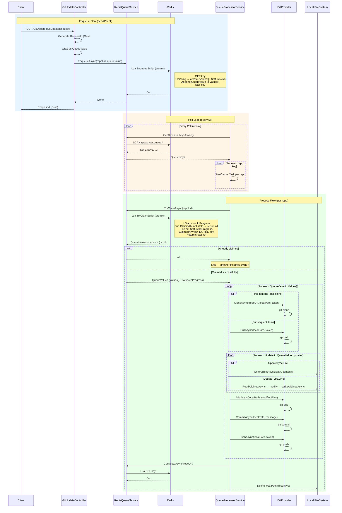

```mermaid
sequenceDiagram
    participant Client
    participant Controller as GitUpdateController
    participant QueueSvc as RedisQueueService
    participant Redis
    participant Processor as QueueProcessorService
    participant GitProvider as IGitProvider
    participant FileSystem as Local FileSystem

    %% === Enqueue Flow ===
    rect rgb(230, 245, 255)
        Note over Client, Redis: Enqueue Flow (per API call)
        Client->>Controller: POST /GitUpdate (GitUpdateRequest)
        Controller->>Controller: Generate RequestId (Guid)
        Controller->>Controller: Wrap as QueueValue
        Controller->>QueueSvc: EnqueueAsync(repoUrl, queueValue)
        QueueSvc->>Redis: Lua EnqueueScript (atomic)
        Note right of Redis: GET key<br/>If missing → create {Values:[], Status:New}<br/>Append QueueValue to Values[]<br/>SET key
        Redis-->>QueueSvc: OK
        QueueSvc-->>Controller: Done
        Controller-->>Client: RequestId (Guid)
    end

    %% === Poll Loop ===
    rect rgb(255, 245, 230)
        Note over Processor, Redis: Poll Loop (every 5s)
        loop Every PollInterval
            Processor->>QueueSvc: GetAllQueueKeysAsync()
            QueueSvc->>Redis: SCAN gitupdater:queue:*
            Redis-->>QueueSvc: [key1, key2, ...]
            QueueSvc-->>Processor: Queue keys

            loop For each repo key
                Processor->>Processor: Start/reuse Task per repo
            end
        end
    end

    %% === Process Flow ===
    rect rgb(230, 255, 230)
        Note over Processor, FileSystem: Process Flow (per repo)
        Processor->>QueueSvc: TryClaimAsync(repoUrl)
        QueueSvc->>Redis: Lua TryClaimScript (atomic)
        Note right of Redis: If Status == InProgress<br/>and ClaimedAt not stale → return nil<br/>Else set Status=InProgress,<br/>ClaimedAt=now, EXPIRE key<br/>Return snapshot
        Redis-->>QueueSvc: QueueValues snapshot (or nil)

        alt Already claimed
            QueueSvc-->>Processor: null
            Note over Processor: Skip — another instance owns it
        else Claimed successfully
            QueueSvc-->>Processor: QueueValues (Values[], Status=InProgress)

            loop For each QueueValue in Values[]
                alt First item (no local clone)
                    Processor->>GitProvider: CloneAsync(repoUrl, localPath, token)
                    GitProvider->>GitProvider: git clone
                else Subsequent items
                    Processor->>GitProvider: PullAsync(localPath, token)
                    GitProvider->>GitProvider: git pull
                end

                loop For each Update in QueueValue.Updates
                    alt UpdateType.File
                        Processor->>FileSystem: WriteAllTextAsync(path, contents)
                    else UpdateType.Line
                        Processor->>FileSystem: ReadAllLinesAsync → modify → WriteAllLinesAsync
                    end
                end

                Processor->>GitProvider: AddAsync(localPath, modifiedFiles)
                GitProvider->>GitProvider: git add
                Processor->>GitProvider: CommitAsync(localPath, message)
                GitProvider->>GitProvider: git commit
                Processor->>GitProvider: PushAsync(localPath, token)
                GitProvider->>GitProvider: git push
            end

            %% === Cleanup ===
            Processor->>QueueSvc: CompleteAsync(repoUrl)
            QueueSvc->>Redis: Lua DEL key
            Redis-->>QueueSvc: OK
            Processor->>FileSystem: Delete localPath (recursive)
        end
    end
```