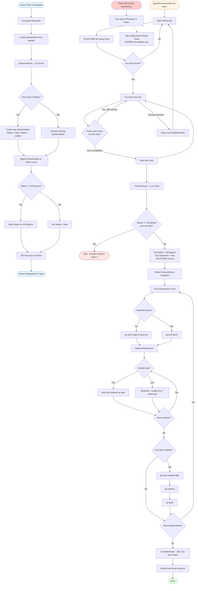

```mermaid
flowchart TD
    %% === API Enqueue ===
    A([Client POST /GitUpdate]) --> B[Generate RequestId]
    B --> C[Create QueueValue from request]
    C --> D[EnqueueAsync - Lua Script]
    D --> E{Key exists in Redis?}
    E -->|No| F[Create new QueueValues\nStatus = New, Values = empty]
    E -->|Yes| G[Decode existing QueueValues]
    F --> H[Append QueueValue to Values array]
    G --> H
    H --> I{Status == InProgress?}
    I -->|Yes| J[Keep Status as InProgress]
    I -->|No| K[Set Status = New]
    J --> L[SET key back to Redis]
    K --> L
    L --> M([Return RequestId to Client])

    %% === Poll Loop ===
    N([QueueProcessorService starts]) --> O[Wait PollInterval]
    O --> P[SCAN Redis for queue keys]
    P --> Q{Any keys found?}
    Q -->|No| O
    Q -->|Yes| R[For each repo key]
    R --> S{Active task exists\nfor this repo?}
    S -->|Yes, still running| R
    S -->|No or completed| T[Start new Task]
    T --> R
    R -->|All keys checked| U[Clean up completed tasks]
    U --> O

    %% === Process Queue ===
    T --> V[TryClaimAsync - Lua Script]
    V --> W{Status == InProgress\nand not stale?}
    W -->|Yes| X([Skip - another instance owns it])
    W -->|No| Y[Set Status = InProgress\nSet ClaimedAt = now\nSet EXPIRE on key]
    Y --> Z[Return QueueValues snapshot]
    Z --> AA[First QueueValue in list]

    AA --> AB{localPath exists?}
    AB -->|No| AC[git clone repo to temp dir]
    AB -->|Yes| AD[git pull latest]
    AC --> AE[ApplyUpdatesAsync]
    AD --> AE

    AE --> AF{Update type?}
    AF -->|File| AG[Write file contents to path]
    AF -->|Line| AH[Read file ? modify line ? write back]
    AG --> AI{More updates?}
    AH --> AI
    AI -->|Yes| AF
    AI -->|No| AJ{Any files modified?}
    AJ -->|No| AK{More QueueValues?}
    AJ -->|Yes| AL[git add modified files]
    AL --> AM[git commit]
    AM --> AN[git push]
    AN --> AK

    AK -->|Yes| AA
    AK -->|No| AO[CompleteAsync - DEL key from Redis]
    AO --> AP[Delete local clone directory]
    AP --> AQ([Done])

    %% === Error / Crash Path ===
    style AR fill:#ffcccc
    AR([Pod crash during processing]) -.-> AS[Key stays InProgress in Redis]
    AS -.-> AT[After StaleClaimTimeout 10min\nEXPIRE auto-deletes key]

    %% Styling
    style A fill:#e6f3ff,stroke:#4a90d9
    style M fill:#e6f3ff,stroke:#4a90d9
    style N fill:#fff5e6,stroke:#d9a04a
    style X fill:#ffe6e6,stroke:#d94a4a
    style AQ fill:#e6ffe6,stroke:#4ad94a
```